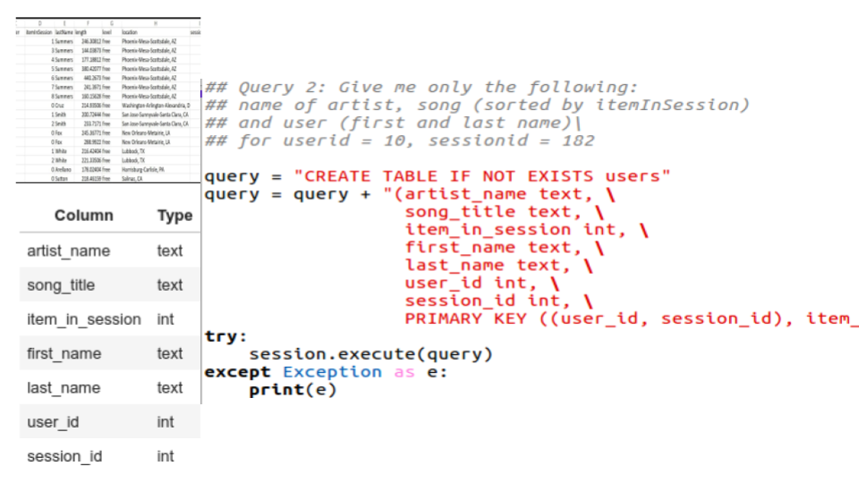

# Summary

- Sparkify startup requested to analyze user activities using song and user data. 
- The project optimizes queries on understanding what songs users are listening to.
- It creates NoSQL database and the Extract, Transform and Load (ETL) pipeline.



# Data
Data for song and user activities is in the _event_data_ directory as CSV files.

## event_data 
- files partitioned by date
- each file is in CSV format 
- example of file paths to two files:

```
event_data/2018-11-08-events.csv
event_data/2018-11-09-events.csv
```

- example of single file:


## event_datafile_new.csv

### The event_datafile_new.csv file contains: 
- artist 
- firstName of user
- gender of user
- item number in session
- last name of user
- length of the song
- level (paid or free song)
- location of the user
- sessionId
- song title
- userId

# Data model

>NoSQL database model is based on **queries** and contains 3 tables **song_history**, **users**, and **song_listened**.


## Query 1

### Give me the artist, song title and song's length in the music app history that was heard during sessionId = 338, and itemInSession = 4

### song_history table

| Column | Type | 
| ------ | ----- |
| artist_name | text| 
| song_title | text|
| song_length | float|
| session_id | int|
| item_in_session | int|

- Primary key will be (session_id, item_in_session)
    - session_id is the partition key 
    - item_in_sessionn is the clustering column.  
   
## Query 2

### Give me the artist, song title and song's length in the music app history that was heard during sessionId = 338, and itemInSession = 4

### users  table

| Column | Type | 
| ------ | ----- |
| artist_name | text| 
| song_title | text|
| item_in_session | int|
| first_name | text|
| last_name | text|
| user_id | int|
| session_id | int|

- Primary key will be (user_id, session_id), item_in_session
    - user_id and session_id make the composite partition key 
    - item_in_sessionn is the clustering column. 

## Query 3

### Give me every user name (first and last) in my music app history who listened to the song 'All Hands Against His Own'

### song_listened table

| Column | Type | 
| ------ | ----- |
| first_name | text| 
| last_name | text|
| song_title | text|
| user_id | int|

- Primary key will be (song_title), user_id
    - song_title is the partition key 
    - user_id is the clustering column.  
    
    
# Project files

## etl.ipynb 
-  creates the data file csv that will be used for Apache Casssandra tables.
- loads processed records into relevant tables 
- tests by running SELECT statements after running the queries on the database.

# Data Engineering projects

## [Data Modeling with Postgres](https://github.com/aymanibrahim/data-modeling-postgres)
## [Data Modeling with Cassandra](https://github.com/aymanibrahim/data-modeling-cassandra)

